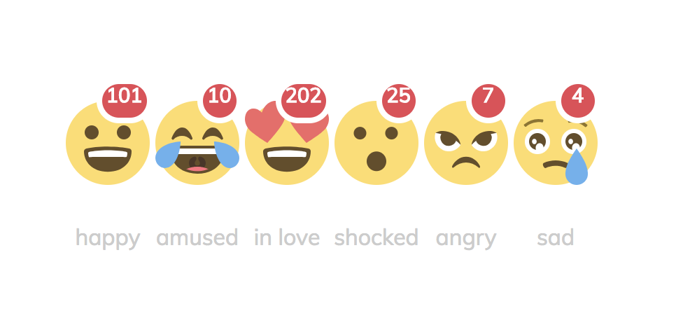

# react-vibes
React JS - Add Reactions To Your Content or WebPages

<h2>How to install ?</h2> 
<pre>
yarn add react-vibes
</pre>

<h2>Example:</h2>



<h1>How to use it ? </h1>

```
import React, {Component} from "react";
import {ReactVibes} from "react-vibes";

class App extends Component {

    constructor() {
        super();
        this.onClickEmoji = this.onClickEmoji.bind(this);
    }

    onClickEmoji = (e) => {
        console.log(e.emoji);
        console.log(e.counter);
    };

    render() {
        return (
            <div className="App">

                <div style={{marginLeft: "600px", marginTop: "200px"}}>

                    <ReactVibes
                        //showAllExcept={ ["happy", "amused", "inLove", "shocked", "angry", "sad"] }
                        //showAllExcept={["shocked", "angry",]}

                        //initialize Counters
                        happyCounter={100}
                        amusedCounter={0}
                        inLoveCounter={200}
                        shockedCounter={12}
                        //angryCounter={0}
                        sadCounter={0}

                        //handle the event of clicks
                        onClick={this.onClickEmoji}

                    />
                </div>

            </div>
        );
    }
}

export default App;

```


<h1>Available Options</h1>

===================================
<h4>You can init the counters by passing props as the following:</h4>

```
<ReactVibes

happyCounter={100}
amusedCounter={0}
inLoveCounter={200}
shockedCounter={12}
angryCounter={0}
sadCounter={0}
/>

```

===================================
<h4>You can show all emojies except some specific ones; for example we don't want to show `amused, and happy`  :</h4>

```
<ReactVibes

showAllExcept={ ["happy", "amused"] }

 />
```

===================================
<h4>There also an event (onClick), using it you can access the current clicked emoji, and the current counter for it:</h4>

```
onClickEmoji = (e) => {
        console.log(e.emoji);
        console.log(e.counter);
    };
```
